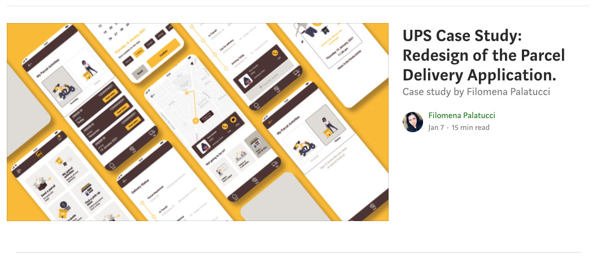
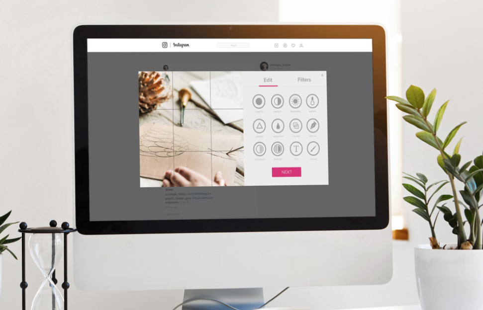
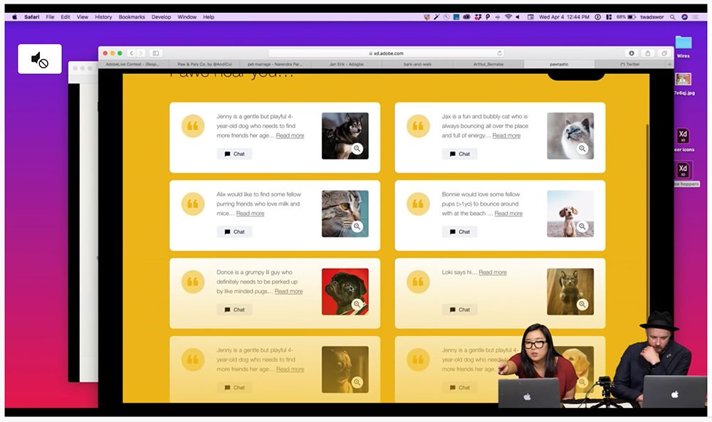

# MSc Digital Design at Solent University

Solent University’s [MSc Digital Design](https://www.solent.ac.uk/courses/postgraduate/digital-design-msc) programme teaches students a wide range of industry-relevant skills including user experience design, front-end web development and digital marketing.

As a conversion course, this master’s degree is well suited to students from diverse academic backgrounds. The course will help you to develop sought-after digital skills and prepare you for a range of careers after graduation.

Students are also able to tailor the course to their own personal career ambitions through a research project. Many use this piece of work to springboard the start of their career or a further research study.

Students are supported to gain a range of transferable skills throughout the course. These include project management, critical thinking, organisation and presentation skills. The professional issues and practise module helps prepare students for the workplace by looking at the wider computing industry and the contexts in which digital skills can be used most effectively

[Find out more about the student experience]()

***

## Student & Alumni Showcase

### Filomena Palatucci

**UPS Case Study: Redesign of the Parcel Delivery Mobile Application.**

*This is a case study on user interface design (UI) for the UPS mobile application. The new design would help users to have more information about the incoming parcels and to re-arrange the delivery time.*

[UPS Case Study: Redesign of the Parcel Delivery Mobile Application.](https://medium.com/ux-ui-design-personal-portfolio/ups-case-study-redesign-of-the-parcel-delivery-application-b0fdef7d0284)

***

### Aysha Samrin - UI Design Case Study: Creating a clickable prototype for a desktop version of Instagram

[Aysha Samrin](https://www.linkedin.com/in/aysha-samrin-designer/)

*Instagram, a fairly new platform for capturing and sharing photos and videos, has quickly grown since its launch in 2010. While Instagram has always maintained that the app has been designed with a focus on mobile-only use, a desktop version was released in 2013 to make the app more accessible to its rapidly growing community. Although the desktop feed functions exactly as the mobile version, allowing users to follow profiles and like pictures, a key feature missing from the current desktop version is the ability to upload photos from a desktop. The reason behind the omission of this crucial feature is that Instagram is designed for capturing and sharing photos in the real world, in real time.*

[UI Design Case Study: Creating a clickable prototype for a desktop version of Instagram](https://ayshasamrin.medium.com/ui-design-case-study-creating-a-clickable-prototype-for-a-desktop-version-of-instagram-4141c84485c20)

***

### Agata gets practical experience in UX/UI design

MSc Digital Design student Agata Jurgelevic worked as an intern at Hinge Agency as a user experience (UX) and user interface (UI) designer. She told us a little about how she got the role, and how she’s finding it.

[Find out more](https://www.solent.ac.uk/news/agata-gets-practical-experience-in-uxui-design)

[Hinge Agency] (https://hinge.agency/blog/upping-our-social-media-game-with-a-lightning-decision-jam/)

***

### MSc Digital Design student Natasha Deacon decided to join in the challenge with only an hour to spare – and won!

With the live episodes aimed at UI/UX designers, MSc Digital Design student [Natasha Deacon](https://www.linkedin.com/in/ndeacon/) decided to join in the challenge with only an hour to spare – and won! She will receive a year’s free subscription of Adobe Creative Cloud.

[Find out more](https://www.solent.ac.uk/news/student-wins-adobe-challenge)